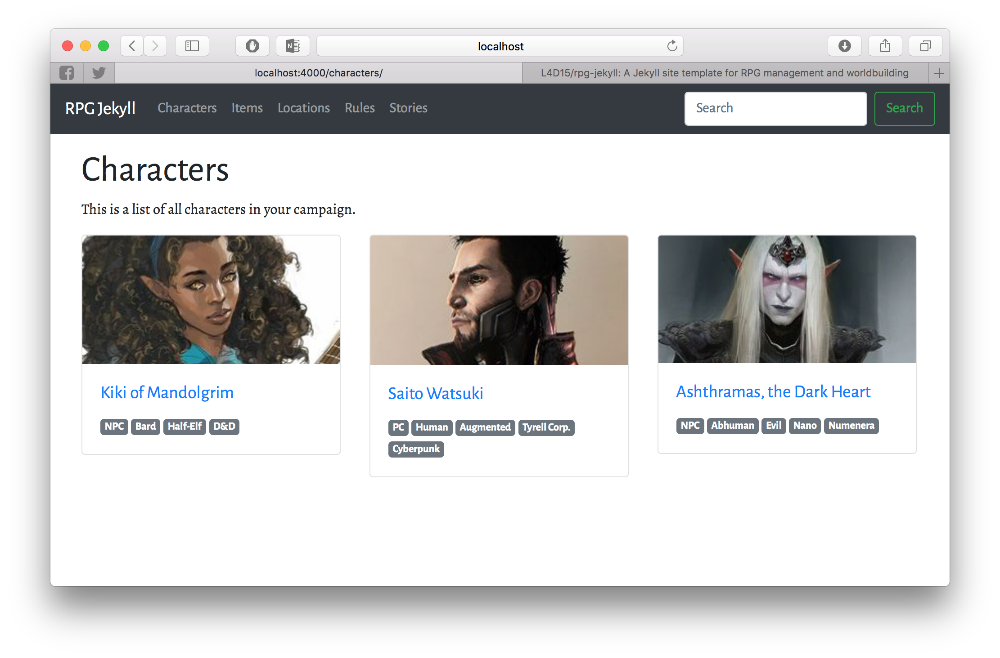

RPG Jekyll
-------------

This is a Jekyll template aimed at RPG campaign management and world building. It comes with custom collections and basic web layout to access all types of contents you could need for your RPG campaing, like characters, locations or items.

## Usage

Requires [Jekyll](https://jekyllrb.com) to be installed in your system. You can build your site use `jekyll build` and upload the generated webpage inside the `_site` folder to whatever web hosting you want to use.

If you want to edit your content and see it update realtime, start a local server with `bundle exec jekyll serve` and navitage to `127.0.0.1:4000` in your web browser. Refresh the page anytime you make a change to one of your files to see the final result. 

## Collections

Default collections are defined for you, such as `Stories`, `Characters` and `Locations`. If you want to define custom collections for your campaign, edit `_config.yml` and add a collection in the `collections` section. To populate your new collection, create a new folder with the name of the collection with an `_` prefix and create new `.md` or `.html` files inside.

The new collection will automatically appear in the top navigation bar, and clicking on that will link to a page with the correct permalink setup for that collection (take a look at the YAML front matter of other `index.html` files in the default collections).
